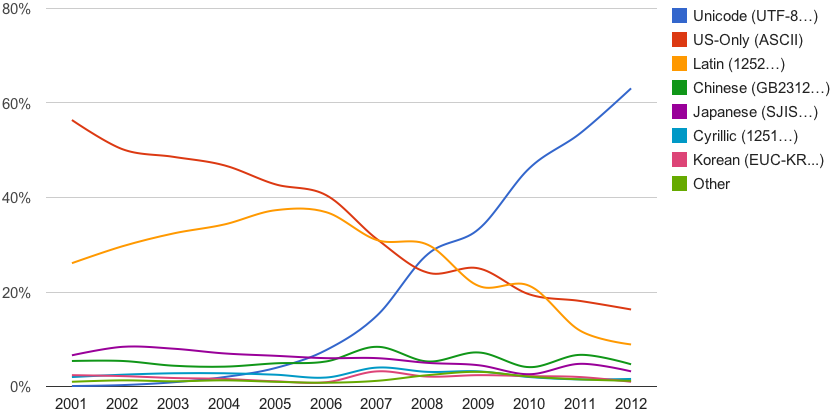

# Go for PHP Developers

# Follow along
- mrf.github.io/go-for-php

# Me
- Director of Engineering at Chapter Three
- PHP'n since 2003
- Golang'n since 2014


# Background
##
"Go is efficient, scalable, and productive. Some programmers find it fun to work in; others find it unimaginative, even boring."

- Rob Pike: talks.golang.org/2012/splash.articl

##
"Most interesting thing about Go is that it's not object oriented or procedural or functional, it's its own new exciting thing"

- David Kinzer: twitter.com/dtkinzer/status/786031866478407681

##
"with Go I was able to pick up programming / CS concepts rather quickly, enjoy the process, and learn a ton of things in the meantime"

- Audrey Lim: youtu.be/fZh8uCInEfw

##
"Although Go is quite a small language, it is a very rich and expressive language (as measured in syntactic constructs, concepts, and idioms), so there is a surprising amount to learn."

- Freddy Rangel: spaces-vs-tabs.com/4-weeks-of-golang-the-good-the-bad-and-the-ugly/

##
"Even if you’re a dynamic language zealot, I bet you’d be shocked how productive you can be with a statically typed language like Go."

- Blake Smith: blakesmith.me/2012/08/19/why-you-should-learn-to-program-in-go.html

##
"Golang is a very pleasant language to get systems-y things done in. I'm fond of saying that it's not an amazing language, but is an amazing programming tool."

- tptacek: news.ycombinator.com/item?id=9381093

##
"When launching a new language it is important that the target audience be able to learn it quickly; rooting Go in the C family helps make sure that young programmers, most of whom know Java, JavaScript, and maybe C, should find Go easy to learn."

- Rob Pike: talks.golang.org/2012/splash.article#TOC_12.


# Hello World

## Download
- https://golang.org/doc/install
- `$ tar -C /usr/local -xzf go1.7.3.linux-amd64.tar.gz`

## Tell Shell about Go
`$ export PATH=$PATH:/usr/local/go/bin`

## Tell Go where your code is
`$ export GOPATH=$HOME/go`

##
```
package main

import "fmt"

func main() {
	fmt.Println("Hello, 世界")
}
```

##
```
...
package main
...
```
"Go encourages you to perform software composition by composing individual pieces of Go packages as an application"

- thenewstack.io/understanding-golang-packages

##
```
...
import "fmt"
...
```

##
```
...
func main() {
	fmt.Println("Hello, 世界")
}
...
```

##



# Free Tools!
## `go get`
- `go get github.com/Netflix/chaosmonkey`

## `go run`

## `go build`

## `go fmt`
- Pollution (won't allow unnused things)
- Tabs vs Spaces (WHO CARES)
- One standard to rule them all

# Syntax

## Functions
```
func add(x int, y int) int
func ReadByte() (c byte, err error)
```

## Variables
```
var c, python, java bool
var i, j int = 1, 2
```

## :=
In Go, := is for declaration + assignment

= is only for assignment

Can also be used for shorthand execution in `if`

## Methods
```
  type Vertex struct {
      X, Y float64
  }

  func (v Vertex) Abs() float64 {
      return math.Sqrt(v.X*v.X + v.Y*v.Y)
  }

  func main() {
      v := Vertex{3, 4}
        fmt.Println(v.Abs())
  }
```

## Arrays vs Slices
- `letters := [26]string{"a","b"........`
- `letters := []string{"a","b"........`
- Zero value of a slice is nil
-   `append()`

## Maps
- `m = map[string]int{}`
- `m["route"] = 66`

## Structs
```
type Vertex struct {
  X int
	Y int
}

func main() {
	v := Vertex{1, 2}
	v.X = 4
	fmt.Println(v.X)
}
```

## Loops
For is Go's "while"

## Defer
A defer statement defers the execution of a function until the surrounding function returns.


# CSP

##
https://en.wikipedia.org/wiki/Communicating_sequential_processes

##
"Do not communicate by sharing memory; instead, share memory by communicating."

- http://www.golangbootcamp.com/book/concurrency

##
```
// A _goroutine_ is a lightweight thread of execution.
```

##
```
    // Suppose we have a function call `f(s)`. Here's how
    // we'd call that in the usual way, running it
    // synchronously.
    f("direct")
```

##
```
    // To invoke this function in a goroutine, use
    // `go f(s)`. This new goroutine will execute
    // concurrently with the calling one.
    go f("goroutine")
```

##
```
    // You can also start a goroutine for an anonymous
    // function call.
    go func(msg string) {
        fmt.Println(msg)
    }("going")
```

##
```
    // Our two function calls are running asynchronously in
    // separate goroutines now, so execution falls through
    // to here. This `Scanln` code requires we press a key
    // before the program exits.
    var input string
    fmt.Scanln(&input)
    fmt.Println("done")
```
## Channels
"Channels are the pipes that connect concurrent goroutines."

- https://gobyexample.com/channels


# Demo Time!
https://github.com/mrf/go-for-php-code

# Resources:
- golang.org/doc/effective_go.html
- r/golang and r/learngolang
- udemy.com/learn-how-to-code/
- infoq.com/presentations/clojure-core-async
- golang.org/doc/effective_go.html
- hackerrank.com
- youtu.be/fZh8uCInEfw
- gitbook.com/book/gobridge/building-web-apps-with-go/details
- golangbootcamp.com
- tour.golang.org or |`go tool tour`|

#Examples
- https://github.com/coreos/etcd
- https://github.com/docker
- https://github.com/hybridgroup/gobot


# Credits:
- https://github.com/eosrei/rjsmake
- http://reneefrench.blogspot.com/
